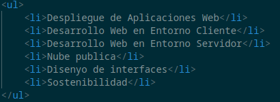

# Ejercicio3
Este es un ejercicio que hemos hecho en **Despliegue de Aplicaciones**, módulo perteneciente al ciclo _Desarrollo de aplicaciones web_ 

## Que incluye este repositorio
Este repositorio incluye un archivo **index.html** en el que hay un listado de los módulos que se imparten _actualmente_.
> _No están todos_

## Aspecto del código
El **código** del listado tiene este aspecto:
```
<ul>
    <li>Módulo 1</li>
    <li>Módulo 2</li>
    <li>Módulo N</li>
</ul>
```
Algo así:



### Cómo contribuir?
---
Actualmente **no está disponible** para _colaboraciones_.
> [Pero puedes descargarte una copia haciendo click aquí](https://github.com/QiweiLiuYang/Ejercicio3)

---
---
### Gracias por leer
---
---